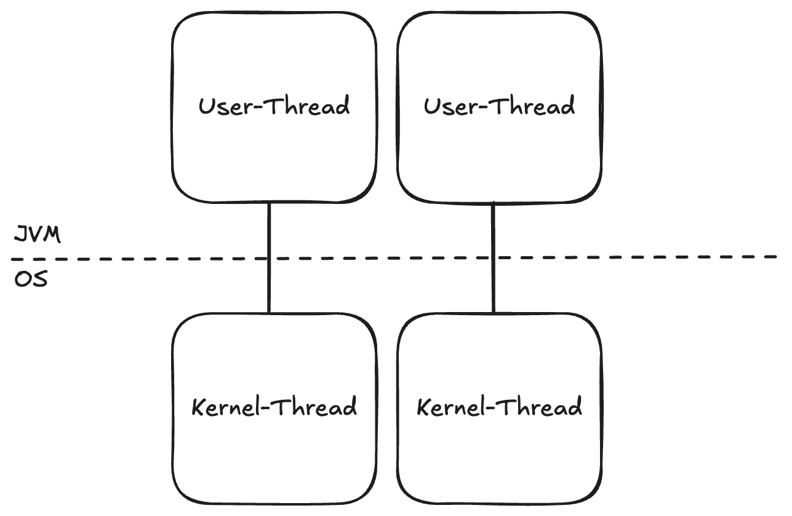
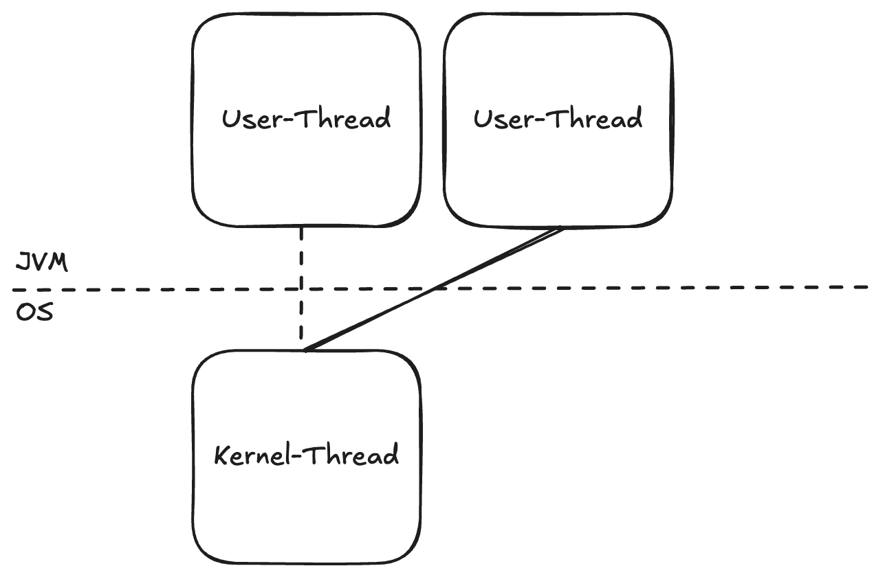

## 전제 지식
- CPU bound, IO bound
- 동기, 비동기, 블로킹, 논블로킹
- 커널 스레드, 유저 스레드

## Java는 왜 비동기 IO에서 까이는가?

비동기 프로그래밍 진영에서 Java가 까일 때 항상 지적받는 부분이 있다. 바로 비동기 IO, 논블로킹 IO에서 상대적으로 약하다는 점이다.

그 이유는 전통적인 자바의 동시성 모델은 **스레드 풀 모델**이고, 다른 언어들은 **코루틴 기반**이거나 **이벤트 루프 기반의 비동기 모델**을 사용하기 때문이다.

사실 CPU bound 작업에서는 Java가 더 뛰어나고, IO bound 작업에서는 코루틴 기반 모델이 뛰어나다. 각자 잘하는 게 다른데 Java가 굳이 까이는 이유는 뭘까?

**대부분의 웹 애플리케이션은 IO bound 작업이 많기 때문이다.**

## 전통적인 자바 스레드 모델의 한계

자바가 IO bound 작업에서 약점을 가질 수밖에 없는 이유는 전통적인 스레드 모델에 있다.

자바의 스레드는 **자바의 유저 스레드와 운영체제의 커널 스레드가 1:1로 매핑**되는 구조다.

이 구조의 문제점은 다음과 같다
- **생성 비용**: 스레드가 갖는 JVM 스택 등을 위해 약 1MB의 메모리가 필요하다
- **스케줄링 비용**: 전적으로 운영체제에게 스케줄링을 맡기기 때문에 컨텍스트 스위칭 비용이 크다

### Spring + Tomcat의 스레드 풀 모델

Tomcat을 사용하는 Spring 애플리케이션은 **Request per Thread 모델**을 사용한다. 즉, 요청과 스레드가 1:1로 매핑되는 형태다.

**스레드 풀에 스레드가 200개라면, 동시 요청은 최대 200개까지만 처리할 수 있다.**

여기서 문제가 발생한다. 만약 이 스레드 중 하나가 DB Lock이나 외부 API 요청 등으로 인해 Block된다면?

**커널 스레드까지 물어놓고 잠들기 때문에 그만큼 동시 요청 처리량이 줄어들게 된다.**

### 코루틴 기반 모델은 어떻게 다른가?

코루틴 기반 모델은 스레드가 IO 작업으로 Block되면, **커널 스레드는 놓아주고** 다른 작업들이 이 커널 스레드를 재활용할 수 있도록 **유저 레벨에서 스케줄링**을 해준다.

즉, N:1 모델이라고 볼 수 있다.

예를 들어 Node.js의 async/await나 Python의 asyncio 같은 것들이 이런 방식으로 동작한다.

그렇기 때문에 더 많은 처리량을 달성할 수 있다.

---

## Virtual Thread: 비용을 극단적으로 줄인 스레드

그렇다면 Project Loom이라는 대형 프로젝트를 통해 Java 21에 정식 합류한 Virtual Thread는 어떨까?

Virtual Thread도 결국 **유저 레벨의 스케줄링을 구현하는 구조**로, 코루틴과 유사한 경량 스레드 모델이라고 볼 수 있다.

왜냐하면
- 커널 레벨에서의 스케줄링은 비싸다
- 전통적인 자바 스레드 모델은 block될 경우 커널 스레드를 잡아놓고 잠든다

Virtual Thread는 이 문제를 해결한다. **Block될 경우 유저 스레드는 커널 스레드를 놓아주어 다른 작업이 재활용(스케줄링)할 수 있도록 한다.**

### Virtual Thread의 이점

그렇기 때문에 Virtual Thread는 다음과 같은 이점을 갖는다
- **더 적은 컨텍스트 스위칭 비용**
- **극단적으로 적은 스레드 생성 비용**: 약 1KB 단위까지 적다고 알려져 있다 (기존 1MB → 1KB)

즉, Virtual Thread는 **전통적인 자바 스레드 모델처럼 사용하며 동기 모델로 구현하되, 스레드의 비용을 극단적으로 줄여서 싼 값에 쓰자는 개념**이다.